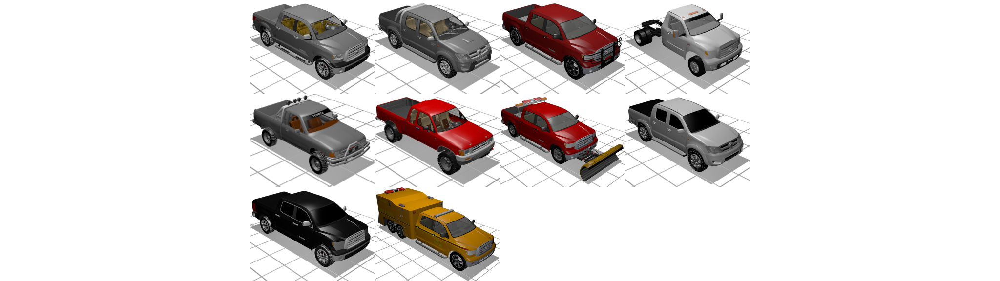

# CADillac

A database of 3D car models and software to render the models on custom background using Blender.

The repo is in development.

## Dataset

The full set of 3D models can be downloaded from:

https://kilthub.cmu.edu/articles/dataset/CADillac/8262593

The dataset is organized as follows. `1be91e1e521b6756f500cc506a763c18` corresponds to the first out of several dozens of collections. It includes `blend` directory with Blender files, one per model, and `examples` directory with visualizations of these models. File `collections_v1.db` is the database with the information about each model.

```
CAD
collections_v1.db
|- 1be91e1e521b6756f500cc506a763c18
   |- blend
   |- examples
|- 5f08583b1f45a9a7c7193c87bbfa9088
   |- blend
   |- examples
...
```

### Visualizations

Below are visualizations of some CAD models from the dataset that satisfy the queries.

Models of length in between 9 and 10 meters


Vans


White Ford


Toyota trucks



Military models.


## License

The code is licensed under Apache 2.

The CAD models may be repurposed under [fair use guidlines](http://fairuse.stanford.edu/overview/fair-use/what-is-fair-use). More information at [3DWarehouse Terms of Use]( https://3dwarehouse.sketchup.com/tos.html).
